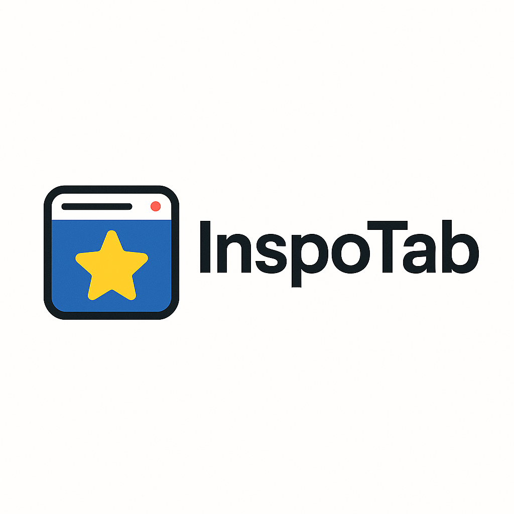

# 🎯 InspoTab

A beautifully minimal Chrome extension that transforms your new tab into a source of **daily inspiration** and **stunning visuals**.

 

&nbsp;

---

## ✨ Features

- 🌟 **Daily Inspirational Quotes** — New motivational quote every time you open a tab  
- 🌄 **Beautiful Backgrounds** — High-resolution images that refresh daily  
- 👋 **Personalized Greetings** — Dynamic messages with your name and time of day  
- 🎨 **Theme Customization** — Choose light or dark mode  
- ✍️ **Font Options** — Sans-serif, serif, or handwriting  
- 🖼️ **Custom Backgrounds** — Upload your own visuals  
- ⌨️ **Keyboard Shortcuts** — For quick access and minimal mode  
- 📋 **Copy to Clipboard** — Easily copy quotes with one click  
- 📱 **Responsive Design** — Works on all screen sizes  

---

## 🚀 Installation

1. Go to the [Chrome Web Store](https://chromewebstore.google.com/detail/ckpplcfeemkpdkkaehicgkcfflmjlhbf?utm_source=item-share-cb)  
2. Click **"Add to Chrome"**  
3. Confirm the install  
4. Open a new tab and feel inspired ✨  

---

## 🎮 Usage

### 🧭 Basic Shortcuts

| Action               | Shortcut |
|----------------------|----------|
| Get new quote        | `R`      |
| Toggle minimal mode  | `H`      |
| Open settings        | `S`      |
| About panel          | `A`      |
| View changelog       | `C`      |
| Close overlays       | `ESC`    |
| Show all shortcuts   | `?`      |

### ⚙️ Settings Overview

**Personalization**
- Add your name
- Select your font style

**Theme**
- Toggle between light and dark modes
- Auto-detect based on system theme

**Backgrounds**
- Upload or reset custom backgrounds

**Shortcuts**
- Enable/disable shortcuts
- View help overlay

---

## 📱 Browser Compatibility

| Browser        | Status          |
|----------------|------------------|
| Chrome         | ✅ Fully supported |
| Edge / Brave   | ✅ Supported      |
| Firefox        | ❌ Not supported  |
| Safari         | ❌ Not supported  |

---

## 📞 Support & Feedback

If you encounter any issues or have suggestions:

1. Go to the [GitHub Issues page](https://github.com/samsnow850/InspoTab/issues)  
2. Open a new issue with details  
3. Mention your **Chrome version** and **extension version**  
4. We'll get back to you ASAP!

---

## 🔄 Changelog

### v1.2.0 (Latest)

- ✅ **Copy quotes** button on hover  
- 🖼️ **Upload custom backgrounds**  
- 🕶️ **Overlay blur** & outside-click close support  
- 💬 Added **100+ new quotes**  
- ⚙️ Settings panel updated with **collapsible sections**  
- 🧹 Interface cleaned & simplified — no more favoriting clutter  

### v1.0.0 (Initial Release)

- Daily inspirational quotes  
- Light/dark theme options  
- Font style picker  
- Personalized greeting  
- Keyboard shortcuts  
- Minimal mode  
- Fully responsive UI  

---

## 📄 License

This project is licensed under the [MIT License](LICENSE).

---

## 👨‍💻 Creator

**Made with ❤️ by Samuel Snow**  
🌐 [inspo.samuelesnow.co](https://inspo.samuelesnow.co)

---

> Start every new tab with a dose of motivation and beauty.  
> _Stay inspired. Stay focused._
